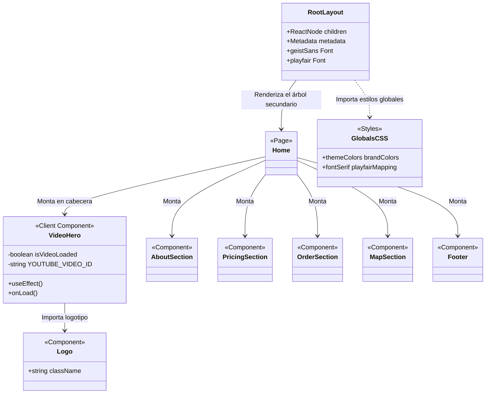
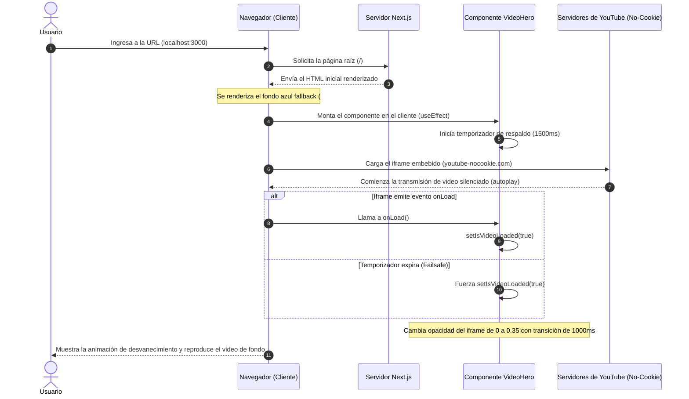

# GUÍA ARQUITECTÓNICA DE COMPONENTES (02_guia_arquitectonica.md)

**ID de Intervención:** KROMA-ALIGN-BLUEBERRY-20260625  
**Fecha de Intervención:** 2026-06-25 23:55:00  
**Autor:** Antigravity (Agente de Inteligencia Artificial - Google DeepMind)  
**Estado:** Auditado, Alineado y Consolidado bajo el Método MAPA  

---

## 🏛️ 1. PROPÓSITO DEL DOCUMENTO

Este documento detalla la estructura arquitectónica, las especificaciones técnicas y el flujo de interacción de los componentes del proyecto **Blueberry Blessings**. Define la jerarquía de renderizado de Next.js (App Router), el flujo de datos del cliente, y los diagramas estructurales para garantizar la mantenibilidad a largo plazo del código por parte de desarrolladores humanos y colaboradores de Inteligencia Artificial.

---

## 🏛️ 2. GUÍA Y ESPECIFICACIÓN DE COMPONENTES

El proyecto está diseñado bajo un modelo híbrido en Next.js, utilizando Server Components por defecto para optimizar el rendimiento y la entrega de HTML (SEO/LCP), y Client Components aislados y atómicos únicamente donde la interactividad del navegador (DOM, eventos y efectos) lo requiera.

Para cumplir con la **Modularidad Crítica (Regla de las 250 líneas)**, la lógica de la landing page ha sido segregada en componentes atómicos individuales y enfocados.

### 2.1. RootLayout (`app/layout.tsx`)
*   **Tipo:** Server Component (Layout de Raíz).
*   **Responsabilidad:** Define el andamiaje del documento HTML, las fuentes tipográficas globales y los metadatos de accesibilidad del sitio.
*   **Especificaciones:**
    *   Carga la fuente sans-serif moderna `Geist` de Google Fonts e inyecta la variable CSS `--font-geist-sans`.
    *   Carga la fuente serif elegante `Playfair Display` de Google Fonts e inyecta la variable CSS `--font-playfair`.
    *   Define los metadatos SEO globales de la plataforma:
        *   `title`: "Growing Together | BC Blueberry Growers"
        *   `description`: "Supporting growers, strengthening communities, and celebrating British Columbia’s blueberry industry."
    *   Configura las clases base del cuerpo (`body`) asegurando un comportamiento fluido y flexible (`min-h-full flex flex-col`).

### 2.2. Home Page (`app/page.tsx`)
*   **Tipo:** Server Component (Página Estática).
*   **Responsabilidad:** Componer la estructura visual de la landing page principal, actuando como un orquestador que ensambla los subcomponentes atómicos sin añadir lógica de renderizado compleja.
*   **Especificaciones:**
    *   Importa y renderiza `VideoHero`, `AboutSection`, `PricingSection`, `OrderSection`, `MapSection` y `Footer`.
    *   Mantiene una extensión ultraligera (menos de 30 líneas físicas de código) que reduce la fatiga cognitiva del asistente de desarrollo.

### 2.3. VideoHero (`components/VideoHero.tsx`)
*   **Tipo:** Client Component (`'use client'`).
*   **Responsabilidad:** Renderizar y controlar la reproducción del video de fondo embebido de YouTube, presentar el menú de navegación y estructurar las columnas de contenido del Hero.
*   **Especificaciones:**
    *   **Variables de Configuración:** `YOUTUBE_VIDEO_ID` (ID único del video de arándanos).
    *   **Estados locales:**
        *   `isVideoLoaded` (boolean): Controla la transición de opacidad del iframe de `0` a `0.35` (reducción de brillo optimizada para contrastar contra el texto) para evitar destellos durante la carga.
    *   **Header y Navegación:**
        *   Coloca el logotipo dorado centrado e inyecta la barra de navegación del mockup: `Home`, `About`, `Shop`, `Recipes`, y `Contact` utilizando la tipografía serif (`font-serif`) y espaciados ampliados.
    *   **Distribución en Dos Columnas:**
        *   *Columna Izquierda*: Títulos de bienvenida en inglés (*Welcome to Blueberry Blessings!*), subtítulos y el botón dorado de acción (*Shop Now*).
        *   *Columna Derecha*: Caja contenedora flotante con la imagen destacada `/blueberry_basket.jpg`, bordes redondeados y efecto de escala en hover.

### 2.4. Logo (`components/Logo.tsx`)
*   **Tipo:** Pure Presentational Component.
*   **Responsabilidad:** Renderizar el monograma oficial de la marca "Blueberry Blessings" en un formato vectorial puro y de alta definición.
*   **Especificaciones:**
    *   Dibuja de forma geométrica los trazos del monograma de las letras "B" entrelazadas en color dorado (`#d4af37`).
    *   Incorpora en el espacio central el diseño de gota con un brote de hojas interiores.

### 2.5. AboutSection (`components/AboutSection.tsx`)
*   **Tipo:** Server Component.
*   **Responsabilidad:** Presentar la narrativa de bienvenida y las novedades de la temporada de cosecha actual de arándanos libres de pesticidas (*spray-free*), enfocada en el inicio de la recolección el sábado 27 de junio de 2026.
*   **Especificaciones:**
    *   Utiliza una cuadrícula responsiva que contrasta una imagen del proceso de recolección (`/blueberry_harvest.jpg`) con el texto descriptivo del boletín informativo.

### 2.6. PricingSection (`components/PricingSection.tsx`)
*   **Tipo:** Server Component.
*   **Responsabilidad:** Mostrar la tabla comparativa de productos y precios de la cosecha actual para compras al por menor y al por mayor de arándanos frescos y bolsas individuales de arándanos congelados.
*   **Especificaciones:**
    *   Tabula detalladamente el precio por libra de arándanos frescos (Regular: `$3.95/lb`, Bulk: `$3.75/lb`), el costo de las cajas de 5 lb (`$20`) y 10 lb (`$40`), y el precio de las bolsas de congelados de 4 lb (`$18`).
    *   Integra informativos de sostenibilidad sobre el reuso de cajas y el retorno de envases para reducción de residuos.

### 2.7. OrderSection (`components/OrderSection.tsx`)
*   **Tipo:** Server Component.
*   **Responsabilidad:** Detallar el procedimiento de reserva, los campos de información necesarios, los horarios del huerto y los métodos de contacto y pago.
*   **Especificaciones:**
    *   Muestra los 7 campos de información requeridos (nombre, celular, email, cantidad, ventana de entrega, fechas de ausencia y contenedores propios).
    *   Provee enlaces dinámicos directos (`tel:` y `mailto:`) para llamadas, mensajes de texto (celular `604-808-9060`) y correo electrónico (`tastyblueberries@gmail.com`).
    *   Establece las advertencias climáticas del huerto (afectaciones por lluvia) y los métodos de pago aceptados (efectivo y eTransfer).

### 2.8. MapSection (`components/MapSection.tsx`)
*   **Tipo:** Server Component.
*   **Responsabilidad:** Mostrar la ubicación del huerto mediante una ilustración cartográfica responsiva en SVG y un botón para navegación por GPS.
*   **Especificaciones:**
    *   Utiliza una composición SVG inline que representa el mapa del área con calles y marcador de posición rojo.
    *   Implementa un enlace de redirección directa al servicio externo de mapas mediante el enlace corto proporcionado: `https://cutt.ly/1TCnpf`.

### 2.9. Footer (`components/Footer.tsx`)
*   **Tipo:** Server Component.
*   **Responsabilidad:** Proveer enlaces a perfiles sociales corporativos y derechos de copyright.
*   **Especificaciones:**
    *   Muestra iconos SVG vectoriales de redes sociales (Facebook, Instagram, YouTube) integrados de forma alineada en color dorado.

---

## 🏛️ 3. DIAGRAMA DE ESTRUCTURA Y CLASES

El siguiente diagrama de clases de Mermaid ilustra la relación jerárquica de los componentes principales del proyecto, sus estados internos, propiedades y flujos de renderizado:

---

## 🏛️ 4. DIAGRAMA DE INTERACCIÓN Y CICLO DE VIDA (SECUENCIA)

El flujo de interacción entre el navegador del cliente, el servidor de Next.js, el componente `VideoHero` y los servidores de entrega de contenido (YouTube) se detalla en el siguiente diagrama de secuencia:

