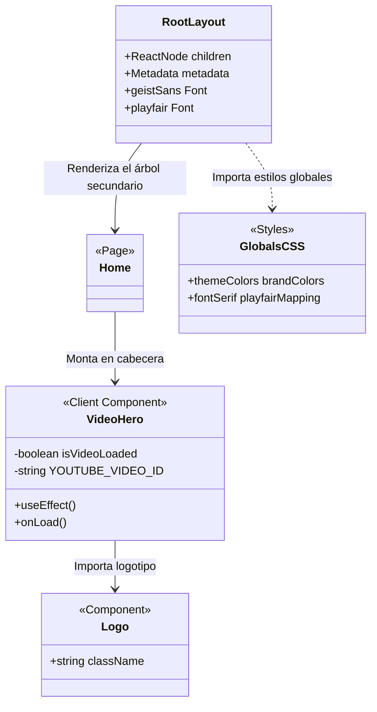
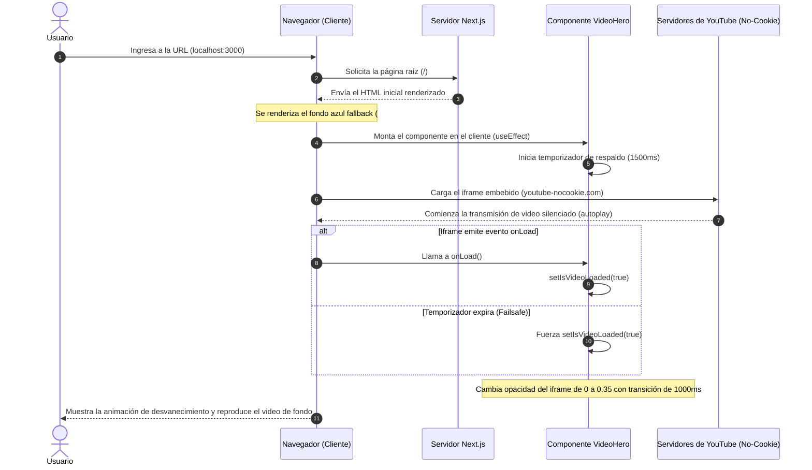

# GUÍA ARQUITECTÓNICA DE COMPONENTES (02_guia_arquitectonica.md)

**ID de Intervención:** KROMA-ALIGN-BLUEBERRY-20260625  
**Fecha de Intervención:** 2026-06-25 23:51:00  
**Autor:** Antigravity (Agente de Inteligencia Artificial - Google DeepMind)  
**Estado:** Auditado, Alineado y Consolidado bajo el Método MAPA  

---

## 🏛️ 1. PROPÓSITO DEL DOCUMENTO

Este documento detalla la estructura arquitectónica, las especificaciones técnicas y el flujo de interacción de los componentes del proyecto **Blueberry Blessings**. Define la jerarquía de renderizado de Next.js (App Router), el flujo de datos del cliente, y los diagramas estructurales para garantizar la mantenibilidad a largo plazo del código por parte de desarrolladores humanos y colaboradores de Inteligencia Artificial.

---

## 🏛️ 2. GUÍA Y ESPECIFICACIÓN DE COMPONENTES

El proyecto está diseñado bajo un modelo híbrido en Next.js, utilizando Server Components por defecto para optimizar el rendimiento y la entrega de HTML (SEO/LCP), y Client Components aislados y atómicos únicamente donde la interactividad del navegador (DOM, eventos y efectos) lo requiera.

### 2.1. RootLayout (`app/layout.tsx`)
*   **Tipo:** Server Component (Layout de Raíz).
*   **Responsabilidad:** Define el andamiaje del documento HTML, las fuentes tipográficas globales y los metadatos de accesibilidad del sitio.
*   **Especificaciones:**
    *   Carga la fuente sans-serif moderna `Geist` de Google Fonts e inyecta la variable CSS `--font-geist-sans`.
    *   Carga la fuente serif elegante `Playfair Display` de Google Fonts e inyecta la variable CSS `--font-playfair`.
    *   Define los metadatos SEO globales de la plataforma:
        *   `title`: "Growing Together | BC Blueberry Growers"
        *   `description`: "Supporting growers, strengthening communities, and celebrating British Columbia’s blueberry industry."
    *   Configura las clases base del cuerpo (`body`) asegurando un comportamiento fluido y flexible (`min-h-full flex flex-col`).

### 2.2. Home Page (`app/page.tsx`)
*   **Tipo:** Server Component (Página Estática).
*   **Responsabilidad:** Componer la estructura visual de la landing page principal, ensamblando el bloque Hero animado, la cuadrícula de tarjetas de información y el pie de página.
*   **Especificaciones:**
    *   Importa y renderiza el componente interactivo `VideoHero` en la parte superior.
    *   Renderiza una cuadrícula de tres columnas dedicada a las tarjetas informativas detalladas en el mockup (Our Harvest, Natural Delights, y Visit Us).
    *   Estructura la tarjeta "Visit Us" utilizando un mapa de vectores interactivo en formato SVG inline, garantizando la responsividad y una nitidez del 100% en pantallas Retina sin dependencias de red externas.
    *   Renderiza el pie de página (`Footer`) de la marca con bordes dorados, centrado de iconos de redes sociales y notas de copyright.

### 2.3. VideoHero (`components/VideoHero.tsx`)
*   **Tipo:** Client Component (`'use client'`).
*   **Responsabilidad:** Renderizar y controlar la reproducción del video de fondo embebido de YouTube, presentar el menú de navegación y estructurar las columnas de contenido del Hero.
*   **Especificaciones:**
    *   **Variables de Configuración:** `YOUTUBE_VIDEO_ID` (ID único del video de arándanos).
    *   **Estados locales:**
        *   `isVideoLoaded` (boolean): Controla la transición de opacidad del iframe de `0` a `0.35` (reducción de brillo optimizada para contrastar contra el texto) para evitar destellos durante la carga.
    *   **Header y Navegación:**
        *   Coloca el logotipo dorado centrado e inyecta la barra de navegación del mockup: `Home`, `About`, `Shop`, `Recipes`, y `Contact` utilizando la tipografía serif (`font-serif`) y espaciados ampliados.
    *   **Distribución en Dos Columnas:**
        *   *Columna Izquierda*: Títulos de bienvenida en inglés (*Welcome to Blueberry Blessings!*), subtítulos y el botón dorado de acción (*Shop Now*).
        *   *Columna Derecha*: Caja contenedora flotante con la imagen destacada `/blueberry_basket.jpg`, bordes redondeados y efecto de escala en hover.

### 2.4. Logo (`components/Logo.tsx`)
*   **Tipo:** Pure Presentational Component.
*   **Responsabilidad:** Renderizar el monograma oficial de la marca "Blueberry Blessings" en un formato vectorial puro y escalable.
*   **Especificaciones:**
    *   Dibuja de forma geométrica los trazos del monograma de las letras "B" entrelazadas en color dorado (`#d4af37`).
    *   Incorpora en el espacio central el diseño de gota con un brote de hojas interiores.

---

## 🏛️ 3. DIAGRAMA DE ESTRUCTURA Y CLASES

El siguiente diagrama de clases de Mermaid ilustra la relación jerárquica de los componentes principales del proyecto, sus estados internos, propiedades y flujos de renderizado:

---

## 🏛️ 4. DIAGRAMA DE INTERACCIÓN Y CICLO DE VIDA (SECUENCIA)

El flujo de interacción entre el navegador del cliente, el servidor de Next.js, el componente `VideoHero` y los servidores de entrega de contenido (YouTube) se detalla en el siguiente diagrama de secuencia:

